# Exploring the Fraud Detection Feature Set 
In the [previous notebook](./Data_Acquire_Clean.ipynb), we put together a dataframe of available merchant account information, with approximately **2.9%** of the observations identified as fraudulent cases, over roughly a 1.5 year period. Let's load this dataset and try to shed some additional light on the features to try to get healthy predictors of fraudulent merchants.


```python
import pandas as pd
import numpy as np
import matplotlib.pyplot as plt
import seaborn as sns
import datetime
import pytz
import us
from sklearn.metrics.pairwise import pairwise_distances
from sklearn.feature_extraction import DictVectorizer as DV
from sklearn.metrics import jaccard_similarity_score

%matplotlib inline
```


```python
dat = pd.read_csv('./../data/train.csv')
```


```python
dat.sample(10)
```


<div>
<table border="1" class="dataframe">
  <thead>
    <tr style="text-align: right;">
      <th></th>
      <th>merchantidentifier</th>
      <th>IP_Address_organization</th>
      <th>IP_Address_Location</th>
      <th>Pierced_IP_address_organization</th>
      <th>Pierced_IP_address_location</th>
      <th>timezone_differencefromGMT_using_application_device</th>
      <th>date_account_opened</th>
      <th>state_from_application_address</th>
      <th>AreaCodeState</th>
      <th>first_transaction_time</th>
      <th>first_transaction_amount</th>
      <th>dateclosedforfraud</th>
      <th>Flag_for_data_with_fraud_outcomes</th>
      <th>is_fraud</th>
      <th>time_to_first_txn</th>
      <th>loc_hmg_coeff</th>
      <th>state_from_application_address_cd</th>
      <th>AreaCodeState_cd</th>
      <th>org_fraud_prevalence</th>
    </tr>
  </thead>
  <tbody>
    <tr>
      <th>101157</th>
      <td>19830409707</td>
      <td>VERIZON FIOS</td>
      <td>TEXAS</td>
      <td>VERIZON FIOS</td>
      <td>TEXAS</td>
      <td>360.0</td>
      <td>2015-02-04 00:00:00</td>
      <td>TX</td>
      <td>TX</td>
      <td>2015-02-26 11:42:09</td>
      <td>1.00</td>
      <td>NaN</td>
      <td>1</td>
      <td>0</td>
      <td>22</td>
      <td>1.0</td>
      <td>TEXAS</td>
      <td>TEXAS</td>
      <td>0.026693</td>
    </tr>
    <tr>
      <th>88930</th>
      <td>44765531</td>
      <td>TIME WARNER CABLE</td>
      <td>NORTH CAROLINA</td>
      <td>TIME WARNER CABLE</td>
      <td>NORTH CAROLINA</td>
      <td>300.0</td>
      <td>2014-02-20 00:00:00</td>
      <td>NC</td>
      <td>NC</td>
      <td>2014-02-27 13:28:36</td>
      <td>525.00</td>
      <td>NaN</td>
      <td>1</td>
      <td>0</td>
      <td>7</td>
      <td>1.0</td>
      <td>NORTH CAROLINA</td>
      <td>NORTH CAROLINA</td>
      <td>0.025276</td>
    </tr>
    <tr>
      <th>81684</th>
      <td>44685389</td>
      <td>COMCAST CABLE</td>
      <td>FLORIDA</td>
      <td>COMCAST CABLE</td>
      <td>FLORIDA</td>
      <td>300.0</td>
      <td>2014-03-09 00:00:00</td>
      <td>FL</td>
      <td>FL</td>
      <td>2014-04-03 07:57:04</td>
      <td>35.00</td>
      <td>NaN</td>
      <td>1</td>
      <td>0</td>
      <td>25</td>
      <td>1.0</td>
      <td>FLORIDA</td>
      <td>FLORIDA</td>
      <td>0.024647</td>
    </tr>
    <tr>
      <th>123412</th>
      <td>19920425983</td>
      <td>TIME WARNER CABLE</td>
      <td>CALIFORNIA</td>
      <td>TIME WARNER CABLE</td>
      <td>CALIFORNIA</td>
      <td>480.0</td>
      <td>2015-04-16 00:00:00</td>
      <td>CA</td>
      <td>CA</td>
      <td>2015-04-16 17:35:03</td>
      <td>1.00</td>
      <td>NaN</td>
      <td>1</td>
      <td>0</td>
      <td>0</td>
      <td>1.0</td>
      <td>CALIFORNIA</td>
      <td>CALIFORNIA</td>
      <td>0.025276</td>
    </tr>
    <tr>
      <th>73028</th>
      <td>45387713</td>
      <td>VERIZON FIOS</td>
      <td>NEW YORK</td>
      <td>VERIZON FIOS</td>
      <td>NEW YORK</td>
      <td>300.0</td>
      <td>2014-03-15 00:00:00</td>
      <td>NY</td>
      <td>NY</td>
      <td>2014-03-16 07:33:40</td>
      <td>10.88</td>
      <td>NaN</td>
      <td>1</td>
      <td>0</td>
      <td>1</td>
      <td>1.0</td>
      <td>NEW YORK</td>
      <td>NEW YORK</td>
      <td>0.026693</td>
    </tr>
    <tr>
      <th>48498</th>
      <td>38143769</td>
      <td>NORTHROP GRUMMAN CORP.</td>
      <td>NEW YORK</td>
      <td>NORTHROP GRUMMAN CORP.</td>
      <td>NEW YORK</td>
      <td>300.0</td>
      <td>2013-06-06 00:00:00</td>
      <td>MD</td>
      <td>MD</td>
      <td>2013-10-27 09:57:01</td>
      <td>10.00</td>
      <td>NaN</td>
      <td>1</td>
      <td>0</td>
      <td>143</td>
      <td>0.5</td>
      <td>MARYLAND</td>
      <td>MARYLAND</td>
      <td>0.000000</td>
    </tr>
    <tr>
      <th>79960</th>
      <td>43202051</td>
      <td>VERIZON FIOS</td>
      <td>VIRGINIA</td>
      <td>VERIZON FIOS</td>
      <td>VIRGINIA</td>
      <td>300.0</td>
      <td>2013-11-21 00:00:00</td>
      <td>VA</td>
      <td>VA</td>
      <td>2013-11-21 09:06:36</td>
      <td>1.00</td>
      <td>NaN</td>
      <td>1</td>
      <td>0</td>
      <td>0</td>
      <td>1.0</td>
      <td>VIRGINIA</td>
      <td>VIRGINIA</td>
      <td>0.026693</td>
    </tr>
    <tr>
      <th>88714</th>
      <td>46413631</td>
      <td>AT&amp;T WIRELESS</td>
      <td>TEXAS</td>
      <td>AT&amp;T WIRELESS</td>
      <td>TEXAS</td>
      <td>360.0</td>
      <td>2014-07-06 00:00:00</td>
      <td>LA</td>
      <td>LA</td>
      <td>2015-02-09 14:50:19</td>
      <td>10.00</td>
      <td>NaN</td>
      <td>1</td>
      <td>0</td>
      <td>218</td>
      <td>0.5</td>
      <td>LOUISIANA</td>
      <td>LOUISIANA</td>
      <td>0.046667</td>
    </tr>
    <tr>
      <th>125922</th>
      <td>19897326365</td>
      <td>SUDDENLINK COMMUNICATIONS</td>
      <td>TEXAS</td>
      <td>SUDDENLINK COMMUNICATIONS</td>
      <td>TEXAS</td>
      <td>360.0</td>
      <td>2015-05-27 00:00:00</td>
      <td>TX</td>
      <td>TX</td>
      <td>2015-05-29 10:15:43</td>
      <td>30.00</td>
      <td>NaN</td>
      <td>1</td>
      <td>0</td>
      <td>2</td>
      <td>1.0</td>
      <td>TEXAS</td>
      <td>TEXAS</td>
      <td>0.025244</td>
    </tr>
    <tr>
      <th>12362</th>
      <td>28779937</td>
      <td>SOUTH CENTRAL RURAL TELEPHONE CO.</td>
      <td>KENTUCKY</td>
      <td>SOUTH CENTRAL RURAL TELEPHONE CO.</td>
      <td>KENTUCKY</td>
      <td>360.0</td>
      <td>2013-10-01 00:00:00</td>
      <td>KY</td>
      <td>KY</td>
      <td>2013-10-22 09:33:49</td>
      <td>17.49</td>
      <td>NaN</td>
      <td>1</td>
      <td>0</td>
      <td>21</td>
      <td>1.0</td>
      <td>KENTUCKY</td>
      <td>KENTUCKY</td>
      <td>0.000000</td>
    </tr>
  </tbody>
</table>
</div>


## Feature Engineering  

Let's ask ourselves the following questions, and build some features if not already available:  
* Is there a correlation between the time taken from account open to first transaction, and fake merchants?  
* Is there anything peculiar about the first transaction amount distribution between normal and fake merchants?  
* How do the location variables interact with each other to identify fake merchants, if at all?  
    * Specifically, interactions between application IP location, pierced IP location, application device timezone, state on the application address, phone number driven location?  
* What can we learn about the merchants themselves? Do merchants with a large presence see more cases of fraud, after normalizing on the dataset? 

--- 

We start by creating a new feature, *time_to_first_txn* which captures the time taken between account open and first transaction.


```python
dat['date_account_opened'] = pd.to_datetime(dat['date_account_opened'])
dat['first_transaction_time'] = pd.to_datetime(dat['first_transaction_time'])

#new feature
dat['time_to_first_txn'] = (dat['first_transaction_time'] - dat['date_account_opened']).apply(lambda date: date.days)
```

Let's now look at our numericals: time taken to first transaction, and transaction amount, and see how fraudulent cases behave...


```python
g = sns.pairplot(dat, vars=['time_to_first_txn','first_transaction_amount'], hue='is_fraud', 
             size=6, aspect=1, diag_kind='kde', plot_kws={'s':50, 'edgecolor':'black'},
            palette={0:'green',1:'red'})
g.set(title='Time to First Transaction & First Transaction Amount\n for Fraudulent and Genuine Merchants')
```


    <seaborn.axisgrid.PairGrid at 0x121f5f710>


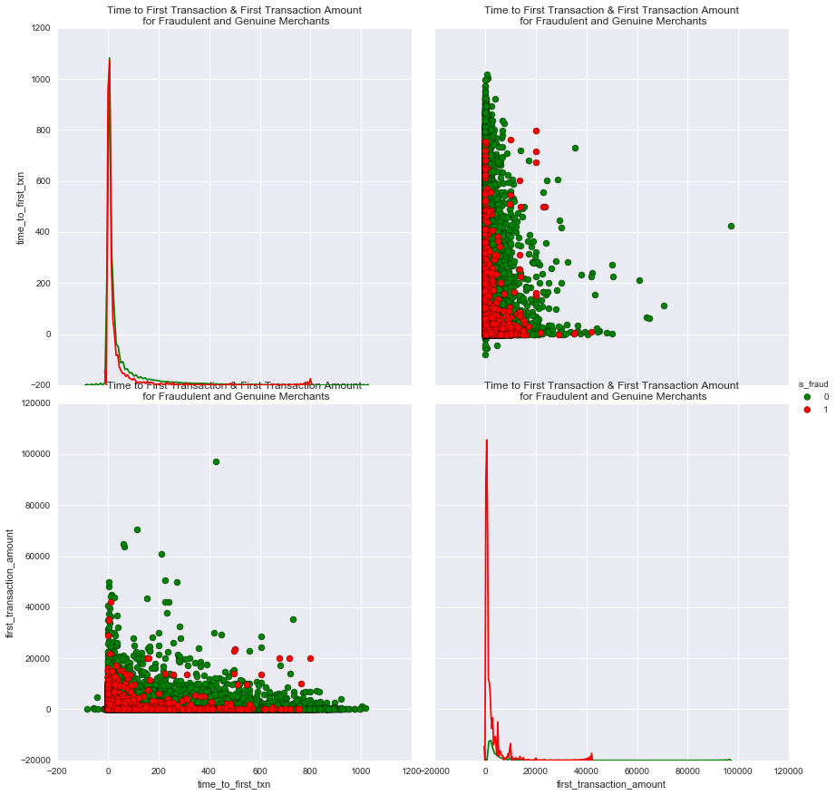


Aha! We observe that while the # of days taken between account open and time to first transaction probably doesn't help discern much between fake and genuine merchants, the *first transaction amount* definitely does! Fraudulent merchants strongly tend to gravitate towards small first transaction amounts.  

> We also note (for later) that there are some seemingly erroneous data points in the dates recorded for account open versus first transaction dates because we see negative days. None of these data points are recorded as fraudulent, so we assume some sort of a data recording error for now. 

Let's take a closer look at the first transaction amount...


```python
plt.figure(figsize=(15,7))
sns.boxplot(data=dat, y='is_fraud', x='first_transaction_amount',
            hue='is_fraud', palette={0:'green',1:'red'}, orient='h')
```


    <matplotlib.axes._subplots.AxesSubplot at 0x1797ee6d0>


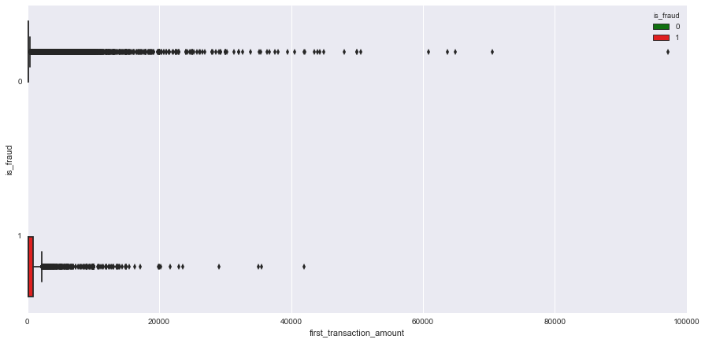


We notice that first transaction amounts tend to vary more for fraudulent merchants. Closer look...


```python
plt.figure(figsize=(15,7))
p=sns.boxplot(data=dat, y='is_fraud', x='first_transaction_amount',
            hue='is_fraud', palette={0:'green',1:'red'}, orient='h')
p.set(xlim=(0,2500))

```


    [(0, 2500)]


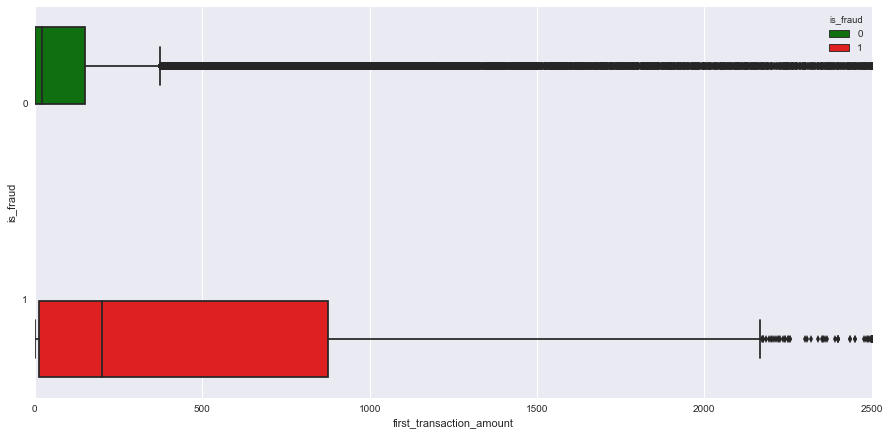


```python
fig, ax = plt.subplots(figsize=(15,6))
dat[dat['is_fraud']==0]['first_transaction_amount'].plot(kind='hist', bins=5000, ax=ax, color='green', label='not fraud')
dat[dat['is_fraud']==1]['first_transaction_amount'].plot(kind='hist', bins=5000, ax=ax, color='red', label='fraud')
ax.legend()
ax.set_title('First Transaction Amount Frequency Distribution \n (Zoomed in view)')
ax.set_xlabel('First Transaction Amount')
ax.set_ylim(0,5000) #zoomed in
ax.set_xlim(0,1000);
```


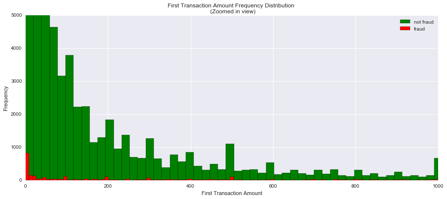


```python
fig, ax = plt.subplots(figsize=(15,6))
dat[dat['is_fraud']==0]['first_transaction_amount'].plot(kind='kde', ax=ax, color='green', label='not fraud')
dat[dat['is_fraud']==1]['first_transaction_amount'].plot(kind='kde', ax=ax, color='red', label='fraud')
ax.legend()
#ax.set_title('First Transaction Amount Frequency Distribution \n (Zoomed in view)')
ax.set_xlabel('Time to First Transaction Amount')
#ax.set_ylim(0,5000) #zoomed in
#ax.set_xlim(-5000,5000);
```


    <matplotlib.text.Text at 0x2deeac710>


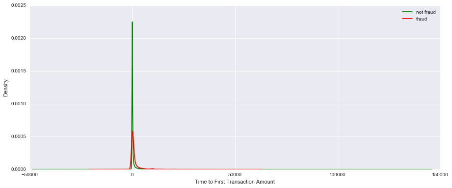


## How do stratified samples look?


```python
#create a "balanced" subset of fraud and non-fraud amounts with the majority non-fraud class downsampled
dat_fraud = dat[dat['is_fraud']==1]
```


```python
dat[dat['is_fraud']==0].sample(dat_fraud.shape[0]).shape
```


    (3771, 19)


```python
dat_strtf = pd.concat([dat_fraud, dat[dat['is_fraud']==0].sample(dat_fraud.shape[0])], axis=0)
```


```python
g = sns.pairplot(dat_strtf, vars=['time_to_first_txn','first_transaction_amount'], hue='is_fraud', 
             size=6, aspect=1, diag_kind='kde', plot_kws={'s':50, 'edgecolor':'black'},
            palette={0:'green',1:'red'})
#g.set(xlim=(0,20000))
#g.set(title='Time to First Transaction & First Transaction Amount\n for Fraudulent and Genuine Merchants (STRATIFIED SAMPLE)')
```


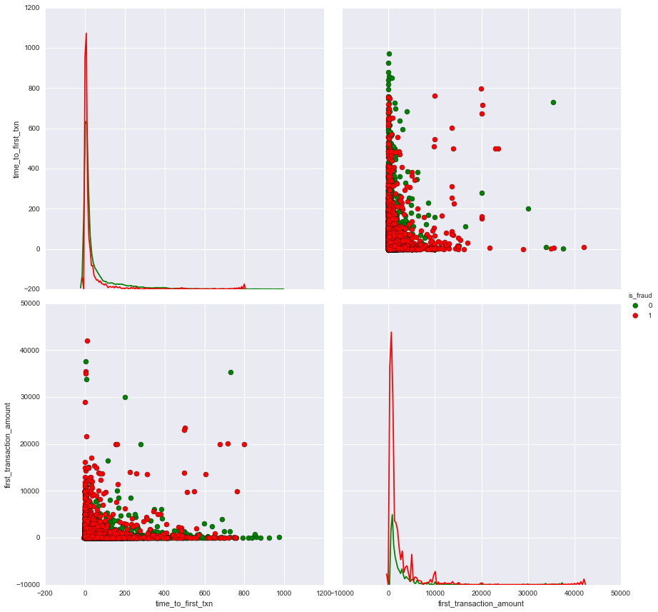


THe stratified sample (non fraud cases downsampled) seems to confirm that smaller *first transaction amounts* are more prevalent amongst fraudulent merchants. *Time to first transaction* is a somewhat weaker indicator, but there is some evidence that there is a higher concentration of fraudulent merchants that have smaller times to first transaction. 

---

### Creating a Similarity Measure of Location Variables (TBD: LOCATION ABBR FOR GMT OFFSET!!!) 

We have 5 types of location information available: application IP loc, application pierced IP loc, application device time-zone, application address driven state, application phone number area code driven state; 

In order to understand how fraudulent merchants behave in terms of these variables, let's create something called a location uniformity score. Ideally, we'd like to see similar location parameters as what's indicated on the application. However, this needn't be the norm (e.g. different phone number, creating account while traveling). So let's see if this can shed any light on fraudulent merchant behavior.

We'll create a location uniformity coefficient for each merchant by computing the *Jaccard Similarity Score* between the location values. This is to give us an idea of how uniformly dissimilar a merchant's location identity is from the assumed ideal of same location value as the application address across all parameters. 

*Note*: With more domain knowledge, it will be more ideal to assign weighted measures to severity of location dissimilarities per metric. For e.g. GMT offset different from application state is worse than pierced IP being different. 


```python
def loc_hom_coeff(X, basis_col, loc_cols):
    """
    Takes in dataframe where the columns represent various location attributes, and computes the 
    Jaccard Similarity Coefficient for each row, while comparing it to a homogenous representation of the row as indicated
    by the location in the "state_from_application_address".
    It returns this similarity score (0 is dis-similar and 1 is the same) as the merchant's 
    location homogeneity coefficient, a floating point value. 
    
    The Jaccard similarity tests two sets for difference in membership by treating each element as unique within the set.
    """
    
    loc_len = len(loc_cols)+1
    #print loc_len
    
    #create a homogenous representation of location from the basis column, for each row
    loc_hom_vecs = list(X[basis_col].apply(lambda val: filter(None, ((val+'%')*loc_len).strip().split('%')) ))
    #print loc_hom_vecs
    
    loc_cols.append(basis_col)
    #print loc_cols
    #for each row in the location space, compute the Jaccard Similarity Coeff. against its homogenous loc. representation
    loc_vecs = map(list, X[loc_cols].values)
    #print loc_vecs
    
    scores = []
    for i in range(len(loc_vecs)):
        #print loc_hom_vecs[i], loc_vecs[i]
        scores.append(jaccard_similarity_score(loc_hom_vecs[i], loc_vecs[i]))
    
    
    return pd.Series(scores)
    
    
    
```

The function I wrote above *loc_hom_coeff()* takes in a target dataframe, computes the Jaccard Similarity Coefficient between the location variables I specify against a homogenous location signature (built from the *state_from_application_address* variable). It returns the dataframe with a new column: *loc_homg_coeff* that captures the merchant's location homegeneity signature, so to speak. 

Let's invoke this function to get our new feature.


```python
dat.sample(3)
```


<div>
<table border="1" class="dataframe">
  <thead>
    <tr style="text-align: right;">
      <th></th>
      <th>merchantidentifier</th>
      <th>IP_Address_organization</th>
      <th>IP_Address_Location</th>
      <th>Pierced_IP_address_organization</th>
      <th>Pierced_IP_address_location</th>
      <th>timezone_differencefromGMT_using_application_device</th>
      <th>date_account_opened</th>
      <th>state_from_application_address</th>
      <th>AreaCodeState</th>
      <th>first_transaction_time</th>
      <th>first_transaction_amount</th>
      <th>dateclosedforfraud</th>
      <th>Flag_for_data_with_fraud_outcomes</th>
      <th>is_fraud</th>
      <th>time_to_first_txn</th>
      <th>loc_hmg_coeff</th>
      <th>state_from_application_address_cd</th>
      <th>AreaCodeState_cd</th>
      <th>org_fraud_prevalence</th>
    </tr>
  </thead>
  <tbody>
    <tr>
      <th>503</th>
      <td>32222143</td>
      <td>CLEAR WIRELESS</td>
      <td>TEXAS</td>
      <td>CLEAR WIRELESS</td>
      <td>TEXAS</td>
      <td>360.0</td>
      <td>2013-07-15</td>
      <td>TX</td>
      <td>TX</td>
      <td>2013-07-20 14:26:24</td>
      <td>1.0</td>
      <td>NaN</td>
      <td>1</td>
      <td>0</td>
      <td>5</td>
      <td>1.00</td>
      <td>TEXAS</td>
      <td>TEXAS</td>
      <td>0.071505</td>
    </tr>
    <tr>
      <th>8597</th>
      <td>30154333</td>
      <td>VERIZON FIOS</td>
      <td>NEW JERSEY</td>
      <td>VERIZON FIOS</td>
      <td>NEW JERSEY</td>
      <td>300.0</td>
      <td>2013-10-08</td>
      <td>NJ</td>
      <td>NJ</td>
      <td>2013-10-21 18:38:28</td>
      <td>10.0</td>
      <td>NaN</td>
      <td>1</td>
      <td>0</td>
      <td>13</td>
      <td>1.00</td>
      <td>NEW JERSEY</td>
      <td>NEW JERSEY</td>
      <td>0.026693</td>
    </tr>
    <tr>
      <th>103368</th>
      <td>47463197</td>
      <td>VERIZON FIOS</td>
      <td>NEW YORK</td>
      <td>VERIZON FIOS</td>
      <td>NEW YORK</td>
      <td>300.0</td>
      <td>2014-06-17</td>
      <td>VA</td>
      <td>NY</td>
      <td>2015-08-07 06:53:45</td>
      <td>80.0</td>
      <td>NaN</td>
      <td>1</td>
      <td>0</td>
      <td>416</td>
      <td>0.25</td>
      <td>VIRGINIA</td>
      <td>NEW YORK</td>
      <td>0.026693</td>
    </tr>
  </tbody>
</table>
</div>


```python
basis_col = 'state_from_application_address_cd'
loc_cols = ['IP_Address_Location','Pierced_IP_address_location','AreaCodeState_cd']

#Change state abbreviations to complete names
dat['state_from_application_address_cd'] = dat['state_from_application_address'].apply(lambda abbr: str(us.states.lookup(unicode(abbr))).upper())
dat['AreaCodeState_cd'] = dat['AreaCodeState'].apply(lambda abbr: str(us.states.lookup(unicode(abbr))).upper())

dat['loc_hmg_coeff'] = loc_hom_coeff(dat, basis_col, loc_cols)
```


```python
fig, ax = plt.subplots(figsize=(15,6))
dat[dat['is_fraud']==0]['loc_hmg_coeff'].plot(kind='kde', ax=ax, color='green', label='not fraud')
dat[dat['is_fraud']==1]['loc_hmg_coeff'].plot(kind='kde', ax=ax, color='red', label='fraud')
ax.legend()
ax.set_ylim(0,6) #zoomed in
plt.title('Location Homogeneity Coefficient Density Plot\n(zoomed in)')
plt.xlabel('Jaccard Similarity Score')
plt.ylabel('Density')
```


    <matplotlib.text.Text at 0x122471290>


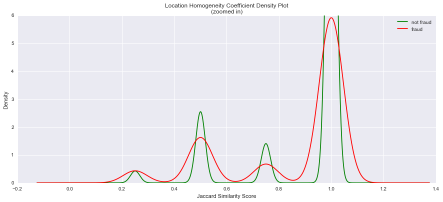


The density plots of the location homogeneity coefficient indicate that _less similar_ location signatures tend to see higher densities of fraudulent merchants as compared to non-fraud merchants. This is indicated by the density of similarity scores in the 0.2-0.4 range for fraudulent merchants being about the same as that of non-fraudulent merchants.

It is conceivable that this distinction at lesser similarity measures might stand out with more data. This is also intuitive as too many differences from the application provided location tend to be less common for static businesses.

## Fraud Frequency by Organization 


```python
#group by pierced firm name and # of subsidiary merchant applications
org_size = pd.DataFrame(dat.groupby(by='Pierced_IP_address_organization').size().sort_values(ascending=False), columns=['merchant_count'])

#group by perced firm name and sum of fraudulent merchants
org_frauds = pd.DataFrame(dat.groupby(by='Pierced_IP_address_organization')['is_fraud'].sum().sort_values(ascending=False))

org_stats = org_size.merge(org_frauds, how='inner', left_index=True, right_index=True)

org_stats['org_fraud_prevalence'] = org_stats['is_fraud']/org_stats['merchant_count']
```


```python
org_stats.sort_values(by='org_fraud_prevalence')['org_fraud_prevalence'].sample(50).plot(kind='bar', 
                                                                                                   figsize=(15,7))
plt.title('Organizational Fraud Priors')
plt.xlabel('Organization')
plt.ylabel('Merchant Fraud Prevalence')
```


    <matplotlib.text.Text at 0x122e99190>


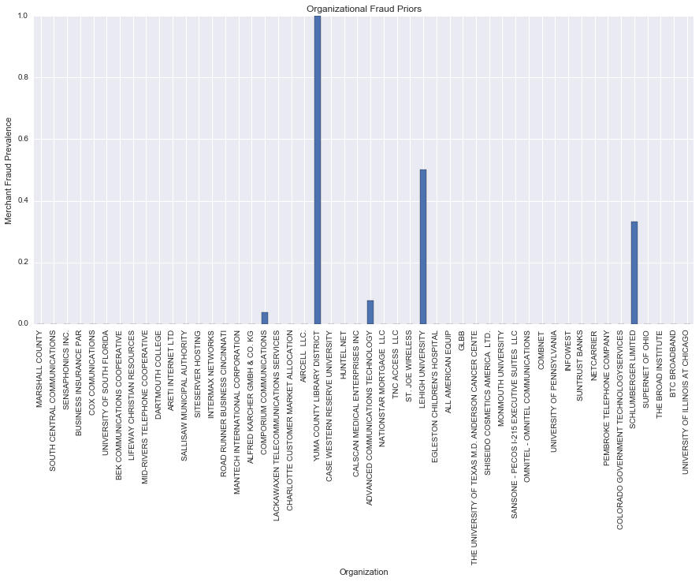


Let's merge the Fraud Prevalence quotient back into the main dataset, to get our new feature that establishes a *prior* likelihood of fraud, given the organization.


```python
dat = dat.merge(pd.DataFrame(org_stats['org_fraud_prevalence']), how='left', left_on='Pierced_IP_address_organization', right_index=True)
```


```python
dat.sample(5)
```


<div>
<table border="1" class="dataframe">
  <thead>
    <tr style="text-align: right;">
      <th></th>
      <th>merchantidentifier</th>
      <th>IP_Address_organization</th>
      <th>IP_Address_Location</th>
      <th>Pierced_IP_address_organization</th>
      <th>Pierced_IP_address_location</th>
      <th>timezone_differencefromGMT_using_application_device</th>
      <th>date_account_opened</th>
      <th>state_from_application_address</th>
      <th>AreaCodeState</th>
      <th>first_transaction_time</th>
      <th>...</th>
      <th>Flag_for_data_with_fraud_outcomes</th>
      <th>is_fraud</th>
      <th>time_to_first_txn</th>
      <th>loc_hmg_coeff</th>
      <th>state_from_application_address_cd</th>
      <th>AreaCodeState_cd</th>
      <th>org_fraud_prevalence_x</th>
      <th>org_fraud_prevalence_y</th>
      <th>is_txn_amt_fraud_prevalence_high</th>
      <th>org_fraud_prevalence</th>
    </tr>
  </thead>
  <tbody>
    <tr>
      <th>82531</th>
      <td>45668505</td>
      <td>TIME WARNER CABLE</td>
      <td>TEXAS</td>
      <td>TIME WARNER CABLE</td>
      <td>TEXAS</td>
      <td>NaN</td>
      <td>2014-04-30</td>
      <td>TX</td>
      <td>TX</td>
      <td>2014-11-12 06:59:22</td>
      <td>...</td>
      <td>1</td>
      <td>0</td>
      <td>196</td>
      <td>1.00</td>
      <td>TEXAS</td>
      <td>TEXAS</td>
      <td>0.025276</td>
      <td>0.025276</td>
      <td>0</td>
      <td>0.025276</td>
    </tr>
    <tr>
      <th>107078</th>
      <td>46280013</td>
      <td>AT&amp;T WIRELESS</td>
      <td>COLORADO</td>
      <td>AT&amp;T WIRELESS</td>
      <td>COLORADO</td>
      <td>480.0</td>
      <td>2014-07-13</td>
      <td>OR</td>
      <td>OR</td>
      <td>2014-07-19 13:22:08</td>
      <td>...</td>
      <td>1</td>
      <td>0</td>
      <td>6</td>
      <td>0.50</td>
      <td>OREGON</td>
      <td>OREGON</td>
      <td>0.046667</td>
      <td>0.046667</td>
      <td>0</td>
      <td>0.046667</td>
    </tr>
    <tr>
      <th>9084</th>
      <td>31045183</td>
      <td>VERIZON WIRELESS</td>
      <td>NEW JERSEY</td>
      <td>VERIZON WIRELESS</td>
      <td>NEW JERSEY</td>
      <td>300.0</td>
      <td>2013-09-11</td>
      <td>NJ</td>
      <td>NY</td>
      <td>2013-09-11 17:53:46</td>
      <td>...</td>
      <td>1</td>
      <td>0</td>
      <td>0</td>
      <td>0.75</td>
      <td>NEW JERSEY</td>
      <td>NEW YORK</td>
      <td>0.024076</td>
      <td>0.024076</td>
      <td>0</td>
      <td>0.024076</td>
    </tr>
    <tr>
      <th>33367</th>
      <td>44448331</td>
      <td>MIDCONTINENT COMMUNICATIONS</td>
      <td>NORTH DAKOTA</td>
      <td>MIDCONTINENT COMMUNICATIONS</td>
      <td>NORTH DAKOTA</td>
      <td>360.0</td>
      <td>2014-02-08</td>
      <td>ND</td>
      <td>ND</td>
      <td>2014-03-11 15:10:24</td>
      <td>...</td>
      <td>1</td>
      <td>0</td>
      <td>31</td>
      <td>1.00</td>
      <td>NORTH DAKOTA</td>
      <td>NORTH DAKOTA</td>
      <td>0.015152</td>
      <td>0.015152</td>
      <td>0</td>
      <td>0.015152</td>
    </tr>
    <tr>
      <th>34172</th>
      <td>43251319</td>
      <td>AT&amp;T INTERNET SERVICES</td>
      <td>NEVADA</td>
      <td>AT&amp;T INTERNET SERVICES</td>
      <td>NEVADA</td>
      <td>480.0</td>
      <td>2013-10-18</td>
      <td>NV</td>
      <td>NV</td>
      <td>2014-12-22 14:15:40</td>
      <td>...</td>
      <td>1</td>
      <td>0</td>
      <td>430</td>
      <td>1.00</td>
      <td>NEVADA</td>
      <td>NEVADA</td>
      <td>0.022649</td>
      <td>0.022649</td>
      <td>0</td>
      <td>0.022649</td>
    </tr>
  </tbody>
</table>
<p>5 rows × 22 columns</p>
</div>


### Prior Fraud Prevalence Correlations 

This new feature opens up a neat set of possible avenues. Let's look at known organization fraud prevalence's interactions with the location homogeneity score and with first transaction amounts...


```python
sns.pairplot(dat, vars=['time_to_first_txn','first_transaction_amount','loc_hmg_coeff','org_fraud_prevalence'], 
             hue='is_fraud', 
             size=4, aspect=1, diag_kind='kde', plot_kws={'s':70, 'edgecolor':'black', 'alpha':0.5},
            palette={0:'green',1:'red'})
```


    <seaborn.axisgrid.PairGrid at 0x28eff53d0>


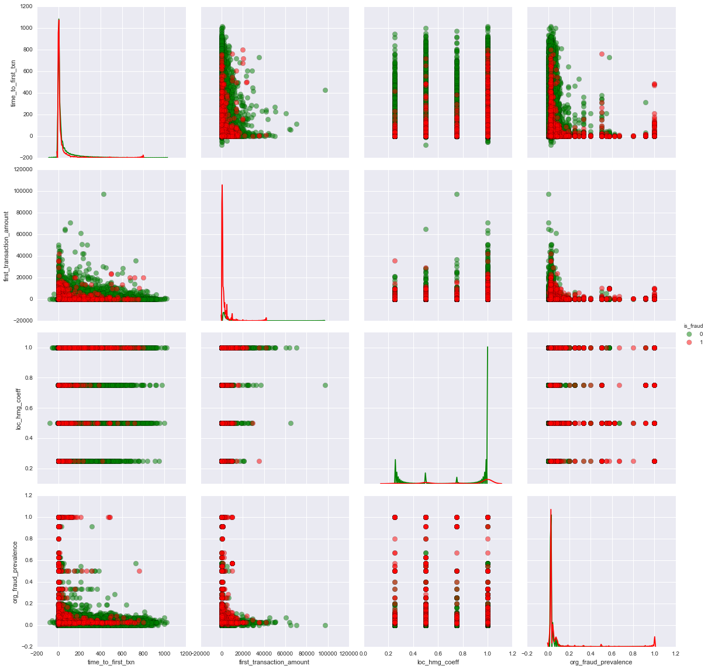


We start to see that the more certain we are of the likelihood of an organization's merchant fraud history, we start to see some subtle correlations such as with time to first transaction (less than a year for strong likelihood of fraud), location homogeneity (less homogenous location variables). 

## First Transaction Amount  

* look at whole number transactions. Intuitively, considering that purchases usually figure in taxes and sticker prices aren't whole number, there may be fewer whole number transactions amongst genuine merchants. 
* Transactions <= $1.00. It's also possible that really trivial amounts (perhaps that are also whole numebrs) are good indicators of fraud.


```python
#build a whole number indicator feature
dat['is_whole'] = np.where(dat['first_transaction_amount']%dat['first_transaction_amount'].astype(int) == 0, 1, 0)
```


```python
#let's see how the fraud distribution looks
dat[['is_whole', 'is_fraud']].groupby(by='is_fraud').sum()
```


<div>
<table border="1" class="dataframe">
  <thead>
    <tr style="text-align: right;">
      <th></th>
      <th>is_whole</th>
    </tr>
    <tr>
      <th>is_fraud</th>
      <th></th>
    </tr>
  </thead>
  <tbody>
    <tr>
      <th>0</th>
      <td>89661</td>
    </tr>
    <tr>
      <th>1</th>
      <td>2657</td>
    </tr>
  </tbody>
</table>
</div>


```python
print '{:03.2f}% of fraudulent merchants have whole number first transactions'.format(2657.0/dat[dat['is_fraud']==1].shape[0] * 100)
```

    70.46% of fraudulent merchants have whole number first transactions


```python
print '{:03.2f}% of genuine cases have whole number first transactions'.format(89661.0/dat[dat['is_fraud']==0].shape[0] * 100)
```

    70.53% of genuine cases have whole number first transactions


As it turns out, my intuition about whole number first transactions was misguided. There doesn't seem to be any perceptible difference in whole number transaction between the two groups. Let's look at the distribution of *trivial* transactions. We'll define *trivial* transactions as those below $1.00


```python
fig, ax = plt.subplots(figsize=(15,6))
dat[((dat['is_fraud']==0) & (dat['first_transaction_amount']<=10))]['first_transaction_amount'].plot(kind='hist', bins=75, ax=ax, color='green', label='not fraud')
dat[((dat['is_fraud']==1) & (dat['first_transaction_amount']<=10))]['first_transaction_amount'].plot(kind='hist', bins=75, ax=ax, color='red', label='fraud')
ax.legend()
ax.set_ylim(0,8000) #zoomed in
```


    (0, 8000)


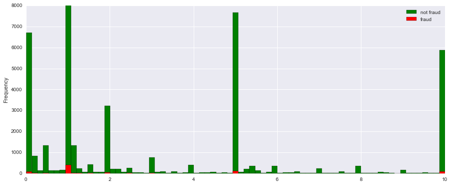


There's a disproportionate amount of fraud at the $10, $5, $1, $0.5 amounts, let's create flags for these.


```python
print '{:03.5f}% $0.01 transactions are fraudulent'.format( (dat[((dat['is_fraud']==1) & (dat['first_transaction_amount']==0.01))]['first_transaction_amount'].shape[0])/ float((dat[((dat['is_fraud']==0) & (dat['first_transaction_amount']==0.01))]['first_transaction_amount'].shape[0])) * 100)
```

    1.42857% $0.01 transactions are fraudulent


```python
print '{:03.5f}% $0.5 transactions are fraudulent'.format( (dat[((dat['is_fraud']==1) & (dat['first_transaction_amount']==0.5))]['first_transaction_amount'].shape[0])/ float((dat[((dat['is_fraud']==0) & (dat['first_transaction_amount']==0.5))]['first_transaction_amount'].shape[0])) * 100)
```

    1.82134% $0.5 transactions are fraudulent


```python
#let's check all small amounts in $0.10 increments from $0 to $1000 for prior fraud prevalence
fraud_prev=[]
amounts = np.arange(0,1000,0.01)
amounts1=[]
for i in amounts:
    try:
        fraud_prev.append(((dat[((dat['is_fraud']==1) & (dat['first_transaction_amount']==i))]['first_transaction_amount'].shape[0])/ float((dat[((dat['is_fraud']==0) & (dat['first_transaction_amount']==i))]['first_transaction_amount'].shape[0]))) * 100)
        amounts1.append(i)
    except ZeroDivisionError:
        fraud_prev.append(np.nan)
        amounts1.append(i)
        continue

amounts1=np.array(amounts1)
fraud_prev = np.array(fraud_prev)
```


```python
amounts1[:20]
```


    array([ 0.  ,  0.01,  0.02,  0.03,  0.04,  0.05,  0.06,  0.07,  0.08,
            0.09,  0.1 ,  0.11,  0.12,  0.13,  0.14,  0.15,  0.16,  0.17,
            0.18,  0.19])


```python
fraud_prev[:20]
```


    array([        nan,  1.42857143,  1.11940299,  0.        ,  0.        ,
            0.64655172,  0.        ,  2.94117647,  2.56410256,  0.        ,
            0.90817356,  3.17460317,  0.        ,  0.        ,  0.        ,
            0.        ,  0.        ,  0.        ,  0.        ,  9.09090909])


```python
#There are 502 transaction amounts less than $1000 that have a higher prevalence of fraud 
#when compared to the overall dataset; 
(fraud_prev>2.88).sum()
```


    502


```python

print '{:03.2f}% of trans. amounts below $1000 see greater than 2.88% fraud prevalence'.format(((fraud_prev>2.88).sum()/float((~np.isnan(fraud_prev)).sum())*100))
```

    4.55% of trans. amounts below $1000 see greater than 2.88% fraud prevalence


We want to create a flag to absorb this prevalence in teh model. 


```python
plt.figure(figsize=(20,7))
plt.plot(amounts1, fraud_prev, 'ro', label='Fraud Prevalence at $ Amount')
plt.plot(amounts1, np.repeat(np.array(2.8), len(amounts1)), 'b--', label = 'Dataset Fraud Prevalence')
plt.xlabel('Transaction Amount (in 0.10 increments)')
plt.ylabel('Fraud Prevalence %')
plt.title('Fraud Prevalence at Whole and Half Dollar Transaction Amounts')
plt.legend()


```


    <matplotlib.legend.Legend at 0x122f8e090>


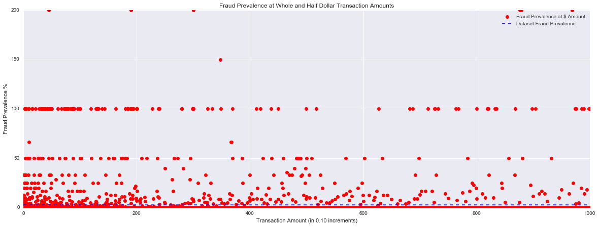


Create feature to absorb these seemingly problematic amounts...


```python
amounts1, fraud_prev
```


    (array([  0.00000000e+00,   1.00000000e-02,   2.00000000e-02, ...,
              9.99970000e+02,   9.99980000e+02,   9.99990000e+02]),
     array([          nan,    1.42857143,    1.11940299, ...,           nan,
                      nan,  100.        ]))


```python
for i,amt in enumerate(np.arange(0,1000,0.01)):
    dat['is_txn_amt_fraud_prevalence_high'] = np.where(((dat['first_transaction_amount']==amt) & (fraud_prev[i]>2.88)),
                                                       1, dat['is_txn_amt_fraud_prevalence_high'])
```


```python
dat['is_txn_amt_fraud_prevalence_high'].value_counts()
```


    0    113810
    1     17078
    Name: is_txn_amt_fraud_prevalence_high, dtype: int64


```python
#drop 'is_whole'
dat.drop('is_whole', axis=1, inplace=True)
```


    ---------------------------------------------------------------------------

    ValueError                                Traceback (most recent call last)

    <ipython-input-130-b8ee5e876685> in <module>()
          1 #drop 'is_whole'
    ----> 2 dat.drop('is_whole', axis=1, inplace=True)
    

    /Users/ash/anaconda/lib/python2.7/site-packages/pandas/core/generic.pyc in drop(self, labels, axis, level, inplace, errors)
       1875                 new_axis = axis.drop(labels, level=level, errors=errors)
       1876             else:
    -> 1877                 new_axis = axis.drop(labels, errors=errors)
       1878             dropped = self.reindex(**{axis_name: new_axis})
       1879             try:


    /Users/ash/anaconda/lib/python2.7/site-packages/pandas/indexes/base.pyc in drop(self, labels, errors)
       3049             if errors != 'ignore':
       3050                 raise ValueError('labels %s not contained in axis' %
    -> 3051                                  labels[mask])
       3052             indexer = indexer[~mask]
       3053         return self.delete(indexer)


    ValueError: labels ['is_whole'] not contained in axis


```python
dat.sample(10)
```


<div>
<table border="1" class="dataframe">
  <thead>
    <tr style="text-align: right;">
      <th></th>
      <th>merchantidentifier</th>
      <th>IP_Address_organization</th>
      <th>IP_Address_Location</th>
      <th>Pierced_IP_address_organization</th>
      <th>Pierced_IP_address_location</th>
      <th>timezone_differencefromGMT_using_application_device</th>
      <th>date_account_opened</th>
      <th>state_from_application_address</th>
      <th>AreaCodeState</th>
      <th>first_transaction_time</th>
      <th>...</th>
      <th>dateclosedforfraud</th>
      <th>Flag_for_data_with_fraud_outcomes</th>
      <th>is_fraud</th>
      <th>time_to_first_txn</th>
      <th>loc_hmg_coeff</th>
      <th>state_from_application_address_cd</th>
      <th>AreaCodeState_cd</th>
      <th>org_fraud_prevalence_x</th>
      <th>org_fraud_prevalence_y</th>
      <th>is_txn_amt_fraud_prevalence_high</th>
    </tr>
  </thead>
  <tbody>
    <tr>
      <th>397</th>
      <td>32155853</td>
      <td>COMCAST CABLE</td>
      <td>MARYLAND</td>
      <td>COMCAST CABLE</td>
      <td>MARYLAND</td>
      <td>300.0</td>
      <td>2013-07-15</td>
      <td>MD</td>
      <td>VA</td>
      <td>2013-08-17 14:38:12</td>
      <td>...</td>
      <td>NaN</td>
      <td>1</td>
      <td>0</td>
      <td>33</td>
      <td>0.75</td>
      <td>MARYLAND</td>
      <td>VIRGINIA</td>
      <td>0.024647</td>
      <td>0.024647</td>
      <td>0</td>
    </tr>
    <tr>
      <th>48572</th>
      <td>36757801</td>
      <td>COMCAST CABLE</td>
      <td>WASHINGTON</td>
      <td>COMCAST CABLE</td>
      <td>WASHINGTON</td>
      <td>480.0</td>
      <td>2013-08-15</td>
      <td>WA</td>
      <td>WA</td>
      <td>2014-05-26 11:28:27</td>
      <td>...</td>
      <td>NaN</td>
      <td>1</td>
      <td>0</td>
      <td>284</td>
      <td>1.00</td>
      <td>WASHINGTON</td>
      <td>WASHINGTON</td>
      <td>0.024647</td>
      <td>0.024647</td>
      <td>0</td>
    </tr>
    <tr>
      <th>34394</th>
      <td>42552995</td>
      <td>COMCAST CABLE</td>
      <td>FLORIDA</td>
      <td>COMCAST CABLE</td>
      <td>FLORIDA</td>
      <td>300.0</td>
      <td>2013-09-03</td>
      <td>FL</td>
      <td>FL</td>
      <td>2013-09-09 12:36:34</td>
      <td>...</td>
      <td>NaN</td>
      <td>1</td>
      <td>0</td>
      <td>6</td>
      <td>1.00</td>
      <td>FLORIDA</td>
      <td>FLORIDA</td>
      <td>0.024647</td>
      <td>0.024647</td>
      <td>0</td>
    </tr>
    <tr>
      <th>48329</th>
      <td>35793061</td>
      <td>T-MOBILE USA</td>
      <td>Unknown</td>
      <td>T-MOBILE USA</td>
      <td>Unknown</td>
      <td>360.0</td>
      <td>2013-11-15</td>
      <td>TX</td>
      <td>TX</td>
      <td>2013-11-26 10:00:21</td>
      <td>...</td>
      <td>NaN</td>
      <td>1</td>
      <td>0</td>
      <td>11</td>
      <td>0.50</td>
      <td>TEXAS</td>
      <td>TEXAS</td>
      <td>0.083616</td>
      <td>0.083616</td>
      <td>0</td>
    </tr>
    <tr>
      <th>36791</th>
      <td>41630159</td>
      <td>AT&amp;T WIRELESS</td>
      <td>MISSOURI</td>
      <td>AT&amp;T WIRELESS</td>
      <td>MISSOURI</td>
      <td>360.0</td>
      <td>2013-08-05</td>
      <td>MO</td>
      <td>MO</td>
      <td>2013-08-10 10:17:45</td>
      <td>...</td>
      <td>NaN</td>
      <td>1</td>
      <td>0</td>
      <td>5</td>
      <td>1.00</td>
      <td>MISSOURI</td>
      <td>MISSOURI</td>
      <td>0.046667</td>
      <td>0.046667</td>
      <td>0</td>
    </tr>
    <tr>
      <th>101096</th>
      <td>19830055947</td>
      <td>VERIZON FIOS</td>
      <td>CALIFORNIA</td>
      <td>VERIZON FIOS</td>
      <td>CALIFORNIA</td>
      <td>480.0</td>
      <td>2015-01-24</td>
      <td>CA</td>
      <td>CA</td>
      <td>2015-04-22 08:09:57</td>
      <td>...</td>
      <td>NaN</td>
      <td>1</td>
      <td>0</td>
      <td>88</td>
      <td>1.00</td>
      <td>CALIFORNIA</td>
      <td>CALIFORNIA</td>
      <td>0.026693</td>
      <td>0.026693</td>
      <td>0</td>
    </tr>
    <tr>
      <th>114447</th>
      <td>19998222741</td>
      <td>AMERICAN INFORMATION NETWORK</td>
      <td>DISTRICT OF COLUMBIA</td>
      <td>AMERICAN INFORMATION NETWORK</td>
      <td>DISTRICT OF COLUMBIA</td>
      <td>300.0</td>
      <td>2014-09-11</td>
      <td>DC</td>
      <td>DC</td>
      <td>2015-05-01 11:00:51</td>
      <td>...</td>
      <td>NaN</td>
      <td>1</td>
      <td>0</td>
      <td>232</td>
      <td>1.00</td>
      <td>DISTRICT OF COLUMBIA</td>
      <td>DISTRICT OF COLUMBIA</td>
      <td>0.000000</td>
      <td>0.000000</td>
      <td>0</td>
    </tr>
    <tr>
      <th>67698</th>
      <td>19848049279</td>
      <td>SUDDENLINK COMMUNICATIONS</td>
      <td>MISSOURI</td>
      <td>SUDDENLINK COMMUNICATIONS</td>
      <td>MISSOURI</td>
      <td>360.0</td>
      <td>2014-10-10</td>
      <td>MO</td>
      <td>MO</td>
      <td>2014-10-16 16:02:05</td>
      <td>...</td>
      <td>NaN</td>
      <td>1</td>
      <td>0</td>
      <td>6</td>
      <td>1.00</td>
      <td>MISSOURI</td>
      <td>MISSOURI</td>
      <td>0.025244</td>
      <td>0.025244</td>
      <td>0</td>
    </tr>
    <tr>
      <th>92555</th>
      <td>38121973</td>
      <td>COMCAST BUSINESS COMMUNICATIONS</td>
      <td>PENNSYLVANIA</td>
      <td>COMCAST BUSINESS COMMUNICATIONS</td>
      <td>PENNSYLVANIA</td>
      <td>300.0</td>
      <td>2013-11-13</td>
      <td>NJ</td>
      <td>PA</td>
      <td>2013-12-06 19:35:01</td>
      <td>...</td>
      <td>NaN</td>
      <td>1</td>
      <td>0</td>
      <td>23</td>
      <td>0.25</td>
      <td>NEW JERSEY</td>
      <td>PENNSYLVANIA</td>
      <td>0.022222</td>
      <td>0.022222</td>
      <td>0</td>
    </tr>
    <tr>
      <th>98557</th>
      <td>19942923701</td>
      <td>VERIZON WIRELESS</td>
      <td>NEW JERSEY</td>
      <td>VERIZON WIRELESS</td>
      <td>NEW JERSEY</td>
      <td>300.0</td>
      <td>2015-04-07</td>
      <td>MD</td>
      <td>MD</td>
      <td>2015-08-13 09:13:55</td>
      <td>...</td>
      <td>NaN</td>
      <td>1</td>
      <td>0</td>
      <td>128</td>
      <td>0.50</td>
      <td>MARYLAND</td>
      <td>MARYLAND</td>
      <td>0.024076</td>
      <td>0.024076</td>
      <td>1</td>
    </tr>
  </tbody>
</table>
<p>10 rows × 21 columns</p>
</div>


Let's save our work so that we can move to the next phase: Addressing imbalance and training our models.


```python
dat.to_csv('./../data/explored.csv', index=False)
```


```python

```


```python

```


```python

```


```python

```


```python

```


```python

```


```python
#first, build a dict of US states and timezone offsets
from geopy import geocoders # pip install geopy

g = geocoders.GoogleV3()
place, (lat, lng) = g.geocode('AL')
```


    ---------------------------------------------------------------------------

    GeocoderServiceError                      Traceback (most recent call last)

    <ipython-input-821-bde3e03cc6a8> in <module>()
          3 
          4 g = geocoders.GoogleV3()
    ----> 5 place, (lat, lng) = g.geocode('AL')
    

    /Users/ash/anaconda/lib/python2.7/site-packages/geopy/geocoders/googlev3.pyc in geocode(self, query, exactly_one, timeout, bounds, region, components, language, sensor)
        215         logger.debug("%s.geocode: %s", self.__class__.__name__, url)
        216         return self._parse_json(
    --> 217             self._call_geocoder(url, timeout=timeout), exactly_one
        218         )
        219 


    /Users/ash/anaconda/lib/python2.7/site-packages/geopy/geocoders/base.pyc in _call_geocoder(self, url, timeout, raw, requester, deserializer, **kwargs)
        169                 if "timed out" in message:
        170                     raise GeocoderTimedOut('Service timed out')
    --> 171             raise GeocoderServiceError(message)
        172 
        173         if hasattr(page, 'getcode'):


    GeocoderServiceError: <urlopen error [Errno 8] nodename nor servname provided, or not known>


```python
pytz.timezone('US/Eastern')
```


    <DstTzInfo 'US/Eastern' LMT-1 day, 19:04:00 STD>


```python

```


```python

```

## IP Time Zone Vs. Application Time Zone

We'd normally expect these two time zones to be the same, although this isn't a rule; but it would be concerning if there were vast differences in the IP time zone and the timezone registered from the registering device. Let's first map the timezones provided. 


```python
#code to track differnt locations:
#_ _ _ _ _; ip loc, pierced ip loc, app loc, area code loc, pierced ip Vs. device Time Zone; can have 16 different combinations here;
#fraud % by:
# location codes
# organization

#fraud by
# time to first transaction
# first trans amount

```
